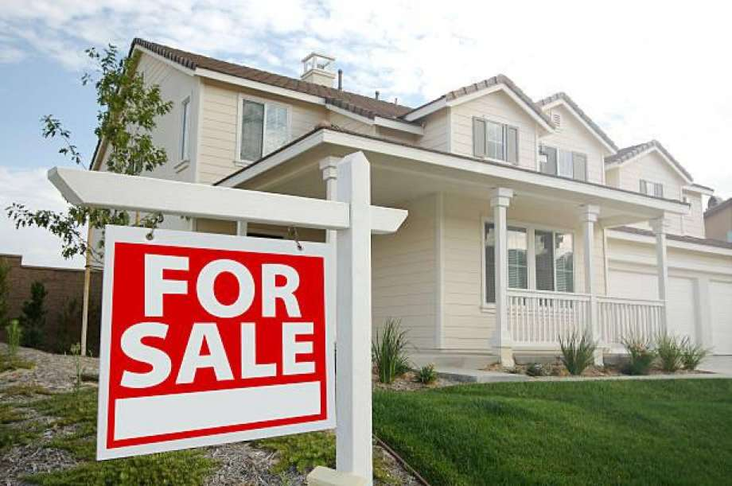
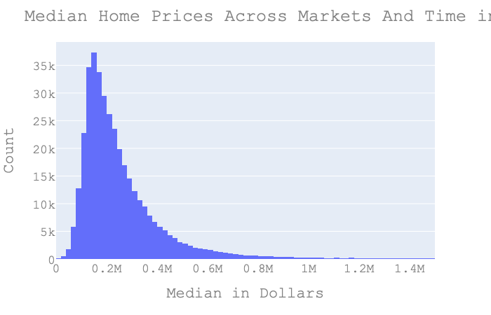
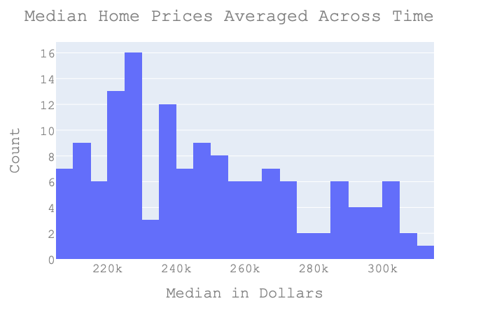
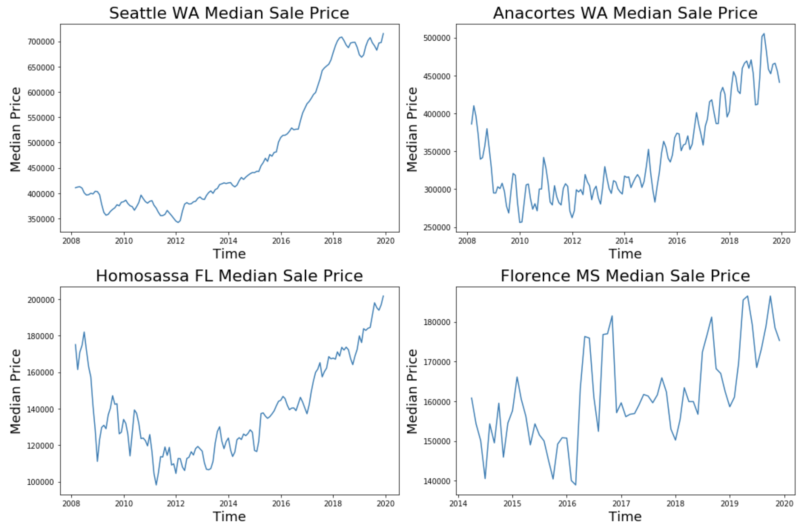
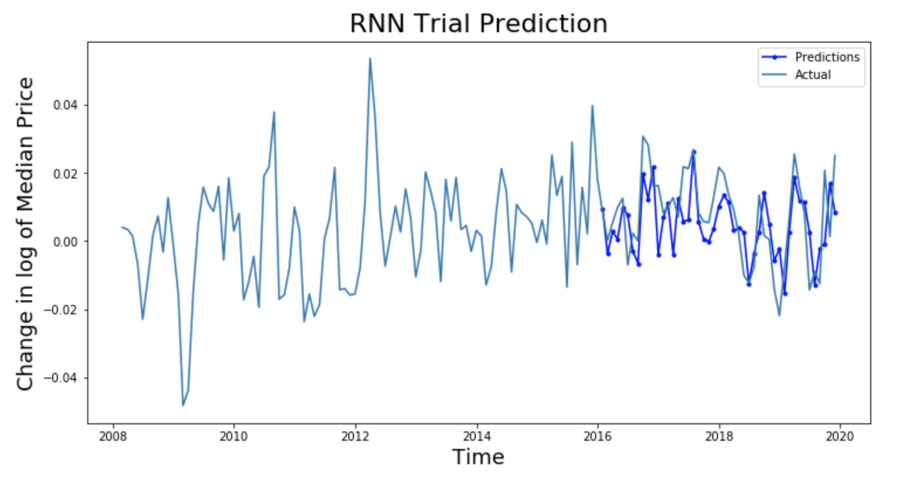

# Homes_For_Sale
Building a predictive model of the housing market

## Introduction

In the U.S., over 14,000 homes are bought and sold every day! With the baby boomer generation reaching retirement age and coming to a point in their lives when moving out of their family rearing homes makes sense this number may be increasing. 

With an asset as expensive as a house, making either a purchase or a sale is no small financial feat. The more informed a party is before entering the market, the better off they position themselves to make the best deal that they can. While there is some information on the market via sites such as Zillow about future predictions, these can be limited to simply what the average price will do in a year. There is more information available for the rental market, but I find a distinct lack of informational resources for the buyers’ market. In order to provide interested parties with useful information I build a forecast of key indicators for housing market in a given city utilizing panel data. My forecast will only consist of a short-term outlook, nothing past a year, however, for a given city my model will provide monthly information within that year. This can be a useful for anyone looking to buy or sell sometime within the coming year with no exact deadline; having an idea of the best time to sell or buy can make a significant difference for a budget. The size of the price of a home is so high that even a one percent change may be well worth waiting a couple of months for. 

## Exploratory Data Analysis

In order to address this issue, I obtain real estate market data from Zillow, as well as economic data published by various government agencies. Once I collect and compile the data into a format that is compatible with analysis of panel data the first step is to take a look at the data and see what I have. 

I first look at the variable that I am most interested in predicting; median sale price. I get an idea of what is going on as a whole with the following histogram.  

The next histogram shows the spread of the average of all markets' medians grouped by time. 

Then I look at the spread of the means grouped by city across the different time-spans.

Lastly, I look at a plot of this variable over time for a single market, I choose to look at Seattle as this is where I am currently located, as well as several other random locations. These can be seen below to get an idea of how the price within a given city has been fluctuating since 2008 or so. 

One thing to note is that the data for Florence, Mississippi only goes back to 2014. While many cities do have data extending back into 2008, there are a number that do not.

## Modeling The Data

My goal is to generate predictions about future home prices using two different models; first what I consider a more traditional econometric approach with an ARIMA model, and then a recurrent neural network machine learning model. Once I have calibrated predictions from both models I will ensemble the results together to serve as my final output. The advantage to this approach is that ensemble models tend to outperform standalone models both in the fields of data science and economics, and this study can basically be thought of as an exercise in macro-economic forecasting. This phenomenon is due to the fact that different modeling approaches can pick up on different nuances within the data structure, and the fact that an ensemble tends diversify away bias without trading off too heavily with variance, the same way that stock diversification reduces portfolio risk. 

I choose to start with ARIMA as this is the approach that I am more familiar with via my past education in econometric forecasting. 
In order to tune my model to the data I conduct a grid search to optimize the number of auto regressions, differences and past values to take when calculating moving average to minimize error. Grid searching with a simple ARIMA model (no other explanatory variables) concludes that the ideal specification is as an AR(1) model with one difference and a moving average over two periods for the city of Seattle. However, when I conduct this search over different cities, I get different results. This tells me that there is a certain amount of bias present to the specification of the model. The next step is to attempt to see how much variation I find in the optimal ARIMA models for a subsample of different cities within the state of Washington. 

When repeating my grid search over more than a dozen different cities I find that the most common specification is a second differenced model with a four period moving average. Of the cities that had alternate optimal models, there was not a common specification. 

The other metrics that I look at in determining which specification of my model is best for a given city are the Akaike information criterion (AIC) and the Bayesian information criterion (BIC). These measure how well fit a model is to the data while penalizing models for size. This means that to get a better score with these criteria a model an additional variable must have a significantly better fit. The BIC is the stricter of the two, requiring even more improvement to justify adding additional variables to a model. What I see when comparing model specifications that were identified by grid different cities on the same city is that while the BIC is best fit with the specification identified by that city’s grid search the AIC actually improves with alternate models in some cases. 

The likely explanation for this is that there are other explanatory variables that I should be including within my model that are currently unaccounted for. There is a fundamental difference between cities that changes the housing price cycle or structure that is uncaptured by a basic ARIMA model.

Moving forward I find another problem with using ARIMA; the model fails to converge entirely on a specification when I attempt to model values for specific home size. When attempting to create a forecast I generate a straight line 

# Graph of ARIMA result here

I then create a second forecast using a recurring neural network, which is a deep-learning machine learning algorithm. In order to train this model, I input data on housing prices from states other than Washington. This works for the scope of this study as it focuses on predicting home values in areas within Washington state only, however if I were to make predictions outside of Washington state as well, I would employ a more traditional test train split by timeframe. I utilize a Long Short Term Memory (LSTM) network of neural layers, which in laymen’s terms means that my neural network retains memory of events further back in the past as well as the immediate past when making future predictions. This is a fairly standard method when using neural networks for time series forecasting. Before inputting my data for training or making predictions I do a logarithmic transformation of the data, as preliminary testing tells me that my network is much better at learning to predict this form of the data. I then take the first difference of this logarithmic data, which means only looking at the change from one period to the next rather than the logarithmic values. There is evidence that utilizing RNN models on differenced data rather than the data itself produces results that are less biased towards the training data. In other words, I am making sure that I avoid overfitting the data when training my model. The following graph shows the results of the earliest version of an RNN for which I obtained teset results which actually had predictive power.

These transformations do mean that in order to interpret the results of my model when it comes time to make predictions, I must retransform the predictions in order to them interpretable as median home values. 

I train my model on thousands of different observations from six different sets of data, one for each size of home. I do this over five epochs for each group, meaning that for each home size in each state I train with I have it repeat the process of going through all of this data 5 times. 
Once trained I test this model by utilizing a test/train split on cities in states that I don't use for training. I both graphically analyze the results of this testing as well as calculate the mean squared error between the actual and predicted values. 
use this model to generate predictions for markets within Washington state.
